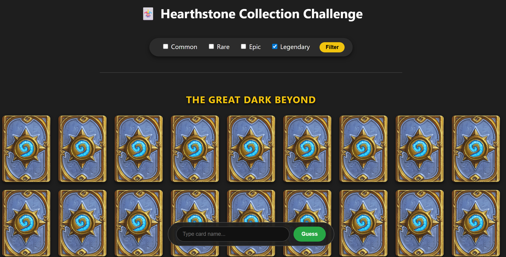

# 🃏 Hearthstone Memory & Guessing Game

This project is a Hearthstone-themed memory and card-guessing game.  
Unlike standard API-based apps, this project generates a local dataset of Hearthstone cards (sourced from
HearthstoneJSON) to ensure fast loading times and zero API rate-limit issues.

It features:

- A Flask web interface where players guess card names.
- **Smart Animations:** The game smooth-scrolls to the card, waits, and then performs a dramatic flip reveal.
- **Current Standard Rotation:** Includes sets like *The Great Dark Beyond*, *Perils in Paradise*, *Whizbang's
  Workshop*, and more.
- **Rarity Filtering:** Filter the board by Common, Rare, Epic, or Legendary.

---

## 🚀 How to Run

### 1. Clone the project

Ensure you have the following file structure:

- `flask_app.py` (The main game server)
- `setup_cards.py` (The data downloader)
- `requirements.txt`
- `static/` folder containing `card_back.png`

### 2. Install dependencies

```bash
pip install -r requirements.txt
```

### 3.⚠️ IMPORTANT: Setup Card Data

Before running the game for the first time, you must download the card data. This script fetches the latest cards and
saves them to a local cards_data.json file (which is ignored by git to keep the repo light).

```bash
python setup_cards.py
```

Wait for the green success message confirming cards were saved.

### 4. Run the Flask app

```bash
python flask_app.py
```

Then, open your browser and go to:

👉 [http://localhost:5000/cards](http://localhost:5000/cards)

Here, you'll see:
- All current **Standard** cards from Blizzard sets.
- Filtering by **rarity** (Common, Rare, Epic, Legendary).
- Guessing input: type a card name to flip it.

---

## 🏆 Game Objective

Your goal is to **guess and flip all the visible cards** by typing their names correctly.  
Once all cards are revealed, a celebratory message will pop up:  
🎉 “Well done! You guessed all cards!”

---

## 📦 Requirements

- Python 3.8+
- Flask
- Requests
- Pillow

These are automatically installed via the `requirements.txt`.

---

## 💡 Features

- 🔁 Flip animation on correct guess
- 🔎 Guess by name (with Enter key or button)
- 📚 Filter by rarity: Common, Rare, Epic, Legendary
- 🪄 Scrolls and animates automatically to reveal found card
- 📦 Full support for Standard sets (e.g. Core, Whizbang’s Workshop)

---

## 🖼️ Screenshots

Here’s what the UI looks like:



---

## 💬 Notes

- Uses real-time data from `omgvamp-hearthstone-v1` API (via RapidAPI)
- Fully supports multiple set sections, visually separated

---

## 📄 License

This project is licensed under the **GPL-3.0 License** – see the [LICENSE](LICENSE) file for details.

---

## 👥 Credits

Made by Urevich Larry and Oran S.Cohen

---

Enjoy and test your Hearthstone card knowledge! 🔍🧠